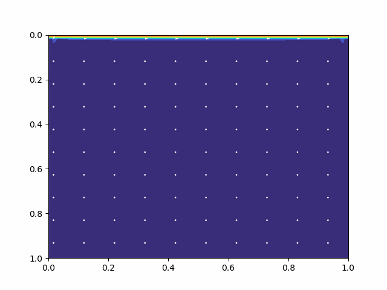

# 2D-Strömungssimulation der Lid-Driven-Cavity 🌀



## Setup mit micromamba (oder conda)

### 1. Umgebung erstellen

```bash
micromamba create -n numerik python=3.11
micromamba activate numerik
```

### 2. Abhängigkeiten installieren

```bash
micromamba install numpy scipy matplotlib imageio
```

> Hinweis: `imageio` wird zur Erstellung von GIFs verwendet. Optional!

## Simulation starten

```bash
python main.py
```

## Kommandozeilenargumente

Beim Start des Programms können optional Flags übergeben werden:

```bash
python main.py [--gif] [--save] [--result_print]
```

| Argument          | Funktion                                                                 |
|-------------------|--------------------------------------------------------------------------|
| `--gif`           | Erstellt am Ende ein animiertes GIF der simulierten Strömung              |
| `--save`          | Speichert die Endzustände (`u`, `v`, `omega`, `psi`) als `.npz`-Datei     |
| `--result_print`  | Gibt die finalen Matrizen nach der Simulation in der Konsole aus         |


## Projektstruktur

```text
.
├── main.py               # Haupt-Simulationslogik und Funktionen
├── fdm.py                # Finite-Differenzen-Ableitungsmatrizen
├── plotting.py           # Visualisierung & GIF-Erstellung
├── plots/                # Ergebnisse
├── gifs/                 # Animierte GIFs der Simulation
├── README.md             
```
